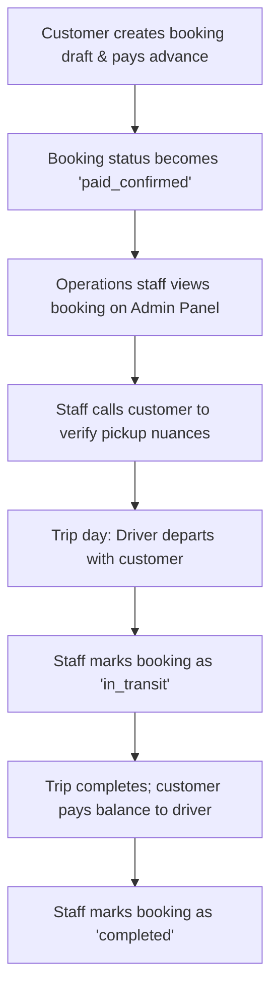
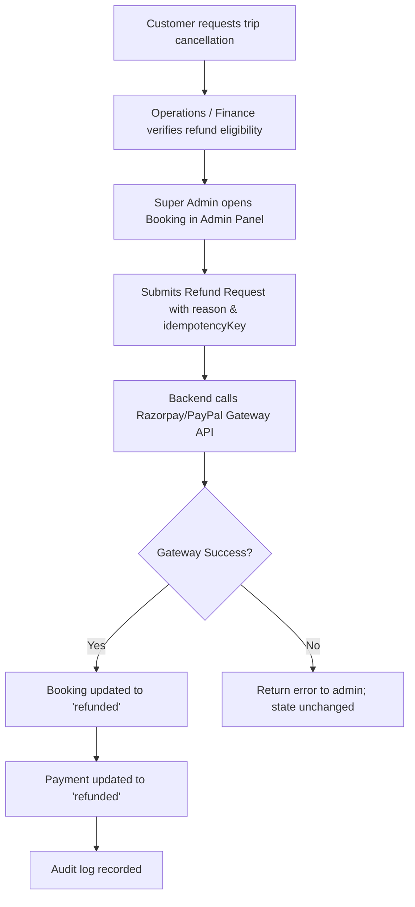
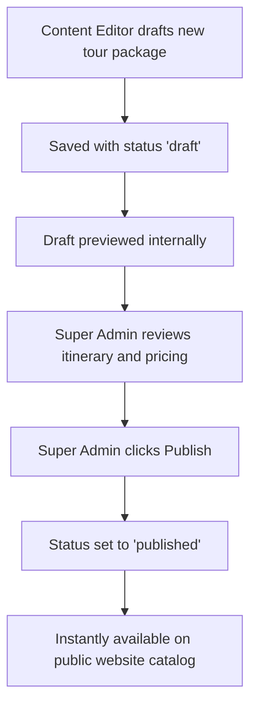

# Product Requirements Document (PRD) — Admin Panel

**Product:** Internal Operations & Administration Panel for **Agra SK Baghel Tour & Travels**  
**Document Version:** 1.0 — Approved Scope Specification  
**Status:** Active Target Specification  
**Project:** `tarun1sisodia/ArenaAI`  
**Related Documents:** [ADMIN_SCOPE_BOUNDARY.md](ADMIN_SCOPE_BOUNDARY.md), [ADMIN_TRD.md](ADMIN_TRD.md), [ADMIN_API_CONTRACT.md](ADMIN_API_CONTRACT.md), [ADMIN_MODELS.md](ADMIN_MODELS.md), [ADMIN_CONTROLLERS.md](ADMIN_CONTROLLERS.md), [BACKEND_RULES.md](BACKEND_RULES.md)

---

## 1. Executive Summary

**Agra SK Baghel Tour & Travels** is a premier tour, outstation taxi, and sightseeing service operating across Agra, Mathura, Vrindavan, Delhi NCR, and Rajasthan. 

The **Admin Panel** serves as the internal back-office management hub for customer service agents, marketing coordinators, operations staff, finance leads, and business owners. It provides centralized visibility and control over:
1. **Booking Lifecycle & Customer Orders**: Verifying customer booking drafts, monitoring payment confirmations, and tracking trip fulfillment.
2. **Payment Reconciliation & Refunds**: Auditing captured Razorpay and international payments, executing authorized customer refunds with idempotency guarantees.
3. **Curated Tour & Ride Catalog (CMS)**: Creating, editing, publishing, and archiving itineraries, day packages, and route offerings.
4. **Verified Customer Review Moderation**: Moderating public reviews submitted by customers against real bookings to maintain authentic social proof.
5. **Customer Inquiries & Lead Management**: Tracking custom tour requests, group queries, and contact form submissions.
6. **Commercial Fare Rules Transparency**: Viewing the server-authoritative fare tables, per-km rates, night allowances, and driver allowance standards.
7. **Audit Trails & Security**: Maintaining an unalterable log of all sensitive staff actions, refund approvals, and data accesses.

> [!IMPORTANT]
> **Strict Operational Model**: Per client mandate, SK Baghel Tour & Travels operates as a boutique private tour and travel desk, **NOT** as an on-demand ride-hailing marketplace (like Uber or Ola). The admin panel **does NOT** contain physical fleet inventory, vehicle registration registries, driver employment rosters, or live GPS telemetry dispatching.

---

## 2. In-Scope: What the Admin Panel WILL Contain

### 2.1. Booking Operations Management
- **Search & Lookup**: Instant lookup by standardized ticket ID (`AGR-YYYYMMDD-XXXX`), customer phone number, or internal booking UUID.
- **Multi-Parameter Filtering**: Filter bookings by:
  - **Status**: `pending_payment`, `paid_confirmed`, `in_transit`, `completed`, `cancelled`, `refunded`.
  - **Trip Type**: `one-way`, `round-trip`, `local-hourly`, `custom-tour`.
  - **Vehicle Pricing Tier**: `sedan`, `ertiga`, `innova-crysta`, `tempo-traveller-12`, `tempo-traveller-17`, `coastal-coach-25`.
  - **Date Range**: Pickup date range, booking creation date range.
- **Detailed Booking Inspection**:
  - Complete itinerary details (origin, destination, pickup address, drop address, scheduled date/time, return date/time, estimated distance).
  - Server-calculated immutable fare snapshot (base fare, night allowance, driver allowance, toll/tax policies, promo discounts, total fare, advance paid, balance payable).
  - Unmasked customer contact information (full phone number, full email address, customer name) visible only to authenticated, authorized staff roles.
  - Associated payment transaction IDs, gateway provider references, and timestamps.
  - Special customer instructions or itinerary notes.
- **Trip Status Transitions**: Ability for operations staff to advance a paid booking through its legitimate operational lifecycle:
  - `paid_confirmed` ➔ `in_transit` (trip started)
  - `in_transit` ➔ `completed` (trip concluded successfully)
  - `paid_confirmed` ➔ `cancelled` (customer cancellation before fulfillment)
  - Optimistic concurrency control via version locking (`expectedVersion`) to prevent race conditions between staff.

### 2.2. Finance & Refund Operations
- **Payment Ledger Audit**: View gateway-confirmed payments, payment method breakdown (UPI, card, net banking, PayPal), provider payment IDs, and capture timestamps.
- **Authorized Refund Processing**:
  - Super admin and finance operators can trigger partial or full refunds against eligible bookings (`paid_confirmed` status).
  - Mandatory reason documentation and unique idempotency keys to prevent duplicate payout triggers.
  - Immediate reconciliation: automated status transition of payment to `refunded` and booking to `refunded`.
  - Seamless integration with payment gateway refund APIs (Razorpay / PayPal / international card processor).

### 2.3. Catalog Content Management System (CMS)
- **Product Categories**: Manage offerings across Rides (point-to-point), Tours (e.g. Same Day Agra Tour, Sunrise Taj Mahal), and Packages (e.g. Golden Triangle 4-Day Tour).
- **Content Drafting & Versioning**:
  - Create and edit draft itineraries without affecting public website visibility.
  - Manage title, URL slug, short summary, rich markdown description, route overview, duration text, and starting price benchmarks.
  - Featured image asset binding.
- **Publication Workflow**:
  - `draft` ➔ `published` (instantly visible on public catalog)
  - `published` ➔ `archived` (delisted from website while preserving historical booking references)
  - Role-gated publishing (requires content editor or super admin privileges).

### 2.4. Customer Review Moderation
- **Moderation Queue**: Dedicated queue for incoming customer reviews in `pending_review` status.
- **Verification Audit**:
  - Cross-reference submitted review with customer ticket ID to confirm authentic trip completion.
  - Assign verification badges (`verified_customer`).
- **Moderation Actions**:
  - Approve review (`approved`).
  - Reject spam, inappropriate language, or unverified claims (`rejected`).
  - Publish approved reviews to public catalog/route pages (`published`).
  - Archive obsolete reviews (`archived`).

### 2.5. Customer Inquiry & Lead Management
- **Inquiry Roster**: Unified inbox for customer contact inquiries, custom itinerary requests, and group charter inquiries submitted via website forms.
- **Status Workflow**: Track lead progression: `new` ➔ `contacted` ➔ `quoted` ➔ `converted` ➔ `closed`.
- **Operator Notes**: Add internal operational notes regarding customer call summaries and custom pricing agreed upon offline.

### 2.6. Commercial Fare Rules & Pricing Inspection
- **Pricing Catalog Inspection**: Real-time view of active commercial rules version (e.g. `2026-09-13`), base fare formulas, per-km rates for each customer vehicle tier, minimum daily distance rules (250 km/day for outstation), night charge rules (10:00 PM – 06:00 AM), and standard driver daily allowances (₹300/day).
- **Rule Integrity**: Admin panel allows inspection and transparent auditing of fare logic, ensuring customer fares calculated by the backend remain 100% compliant with commercial agreements.

### 2.7. Security, RBAC & Audit Logging
- **Granular Role-Based Access Control**:
  - `dispatcher`: Booking search, status transition (`paid_confirmed` ➔ `in_transit` ➔ `completed`), customer unmasking, inquiry handling.
  - `content_editor`: Catalog creation, editing, and drafting.
  - `review_moderator`: Review verification, approval, and rejection.
  - `finance_operator`: Payment auditing, refund eligibility review, refund requests.
  - `super_admin`: Full system control, refund execution, publishing, user management, audit inspection.
- **Immutable Audit Trail**: Automatic recording of every administrative mutation and PII read:
  - Timestamp, actor ID, user role, action type, resource ID, client IP address, and payload diff snapshot.

---

## 3. Out-of-Scope: What the Admin Panel WILL NOT Contain

To maintain operational simplicity, minimize software liability, and adhere strictly to client requirements, the following features are **explicitly excluded**:

```
                              ┌──────────────────────────────────────────────┐
                              │           STRICTLY EXCLUDED DOMAINS          │
                              ├──────────────────────────────────────────────┤
                              │ ❌ Physical Vehicle Fleet Inventory          │
                              │ ❌ Vehicle Maintenance & Registration        │
                              │ ❌ Driver Profiles, Licenses & Rostering    │
                              │ ❌ Manual/Auto Driver Dispatching            │
                              │ ❌ Driver Mobile App / Driver Portals        │
                              │ ❌ Live GPS Telematics & Vehicle Tracking    │
                              │ ❌ Admin Direct Card Charging                │
                              │ ❌ Manual Booking Fare Overrides             │
                              └──────────────────────────────────────────────┘
```

1. **NO Physical Fleet Inventory Management**:
   - No vehicle registration plate tracking (e.g. `UP 80 AB 1234`).
   - No vehicle RC book, chassis number, insurance renewal dates, or PUC certificates.
   - No odometer logs, fuel consumption records, vehicle maintenance or service schedules.
   - *Rationale*: SK Baghel Tour & Travels fulfills trips through trusted partner networks and dedicated operators on a per-trip basis.
2. **NO Driver Personnel & Rostering Management**:
   - No driver profiles, government identity cards (Aadhaar/PAN), driving license copies, or police verification documents in database tables.
   - No driver salary calculation, daily driver shifts, or driver leave rosters.
   - No driver rating or penalty tracking.
3. **NO Driver Assignment & Dispatch Workflows**:
   - No "Assign Driver" or "Assign Vehicle" buttons on booking records.
   - No automated dispatch algorithms, driver push notifications, or driver trip acceptance/rejection flows.
   - No WhatsApp driver voucher generation triggered through the backend. Driver dispatching is coordinated directly by phone/desk operations outside the software.
4. **NO Driver Mobile App or Driver Web Portal**:
   - No software interface, mobile application, or web view built for drivers.
5. **NO Live GPS Tracking & Telematics**:
   - No real-time map tracking of vehicles on trips, no GPS IoT hardware integration, no geofencing, and no live ETA calculations.
6. **NO Direct Admin Card Charging**:
   - Staff cannot type in credit card numbers or initiate arbitrary charges against customers. All payments must be customer-initiated through secure hosted payment sessions (Razorpay/PayPal).
7. **NO Arbitrary Manual Price Overrides on Bookings**:
   - Staff cannot manually overwrite booking fares without recalculating through the fare engine, preserving financial audit integrity.

---

## 4. User Roles & Permission Matrix

| Module / Feature | `dispatcher` | `content_editor` | `review_moderator` | `finance_operator` | `super_admin` |
|---|:---:|:---:|:---:|:---:|:---:|
| **List & Filter Bookings** | ✅ | ❌ | ❌ | ✅ | ✅ |
| **View Unmasked Customer Contact** | ✅ | ❌ | ❌ | ❌ | ✅ |
| **Update Trip Status (In-Transit/Completed)** | ✅ | ❌ | ❌ | ❌ | ✅ |
| **View Payment Ledger & Receipts** | ❌ | ❌ | ❌ | ✅ | ✅ |
| **Execute Payment Refunds** | ❌ | ❌ | ❌ | ❌ | ✅ |
| **Create/Edit Catalog Items (Drafts)** | ❌ | ✅ | ❌ | ❌ | ✅ |
| **Publish/Archive Catalog Items** | ❌ | ❌ | ❌ | ❌ | ✅ |
| **Moderate Reviews (Approve/Reject)** | ❌ | ❌ | ✅ | ❌ | ✅ |
| **Publish Reviews to Public Website** | ❌ | ❌ | ❌ | ❌ | ✅ |
| **Manage Inquiries & Leads** | ✅ | ❌ | ❌ | ❌ | ✅ |
| **View Active Fare Rules & Multipliers** | ✅ | ❌ | ❌ | ✅ | ✅ |
| **View System Audit Logs** | ❌ | ❌ | ❌ | ❌ | ✅ |

---

## 5. Key Operational Workflows

### 5.1. Booking Fulfillment Workflow


### 5.2. Refund Workflow


### 5.3. Catalog Publication Workflow


---

## 6. Success Metrics & Performance KPIs

1. **Staff Productivity**: Zero software friction for desk operators; booking lookups complete in under 2 seconds.
2. **Audit Completeness**: 100% of status transitions, refunds, and unmasked PII views recorded in audit logs.
3. **Zero Fleet Overhead**: 0 database tables, 0 code maintenance, and 0 operational confusion regarding driver/vehicle inventory.
4. **Financial Safety**: 0 duplicate refund executions guaranteed by idempotent keys.
