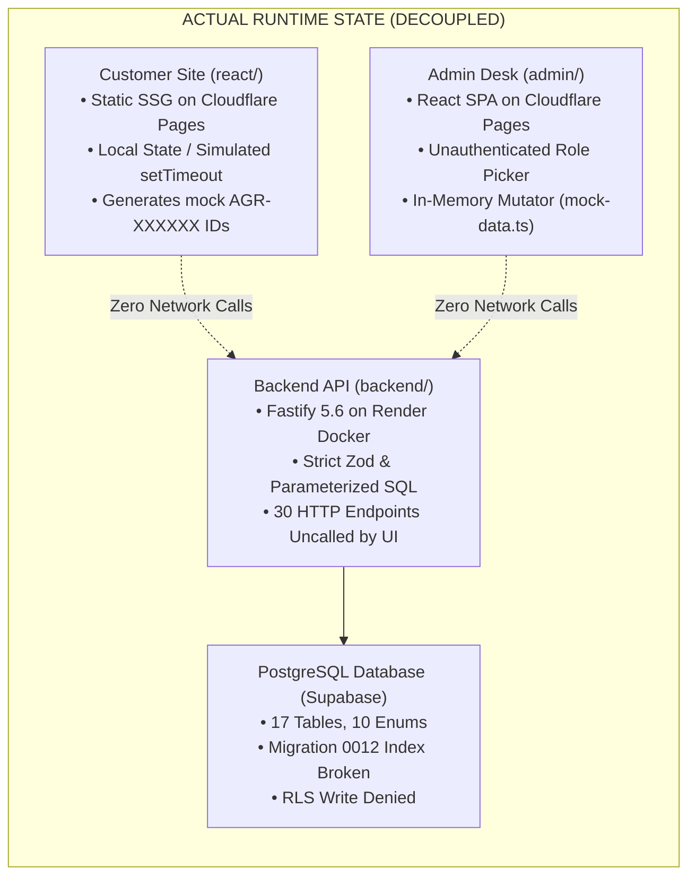
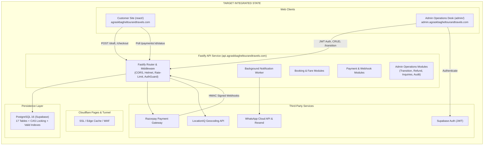

# Monorepo Comprehensive Audit Report & Master Remediation Plan
**Target System:** SK Baghel Tour & Travels (`ArenaAI` Monorepo)  
**Date:** September 16, 2026  
**Auditor Roles:** Senior Software Engineer, Software Architect, QA Engineer, Backend Engineer, Frontend Engineer, and Application Security Engineer  
**Audit Scope:** `react/` (Customer SSG), `admin/` (Operations SPA), `backend/` (Fastify REST API), Database & Migrations (`backend/migrations/`), Authentication, Security & Deployment Topology.  
**Baseline Status:** Typechecks PASS (3/3), Tests PASS (52/52 deterministic unit/contract tests), Builds PASS (Customer 75-page SSG + Admin SPA + Backend Server).

> **Historical snapshot (2026-09-16):** This report predates the API-backed booking/admin integrations and Supabase authentication now present in the repository. Its “mock-only” descriptions record the state observed on that date, not current runtime behavior. Use [`02_PROJECT_CONTEXT.md`](02_PROJECT_CONTEXT.md), [`04_PROGRESS_TRACKER.md`](04_PROGRESS_TRACKER.md), and [`docs/agent/CURRENT_SYSTEM_DEBUGGING_MAP.md`](../agent/CURRENT_SYSTEM_DEBUGGING_MAP.md) for current context.

---

## 1. Executive Summary

A systematic, 11-phase audit of the `ArenaAI` monorepo was conducted. The codebase contains clean TypeScript typing, strict Fastify schemas, strong rate-limiting, and deterministic CI test suites. However, the audit revealed a **fundamental architectural disconnect between the frontend applications and the backend API**:

1. **Both Frontends Run in Complete Isolation:** The customer site (`react/`) and the operations desk (`admin/`) are purely client-side simulations running on `sessionStorage` and in-memory mock data fixtures (`mock-data.ts`). Neither makes network calls to the backend Fastify API for core booking, inquiries, or management flows.
2. **Database Migration Blocker:** Migration `0012_hyper_scale_indexes.sql` crashes on PostgreSQL because it indexes a non-existent enum value (`'driver_assigned'`), preventing clean database initialization.
3. **Admin Security Bypass:** The admin operations desk has no password authentication or Supabase Auth verification; anyone navigating to `/login` can select `Super Admin` and access the operations desk.
4. **Missing Transition Route:** While the backend implements a booking state machine (`bookingService.transition`), it is unexposed on any Fastify HTTP route, leaving dispatchers with no API to transition trips from `paid_confirmed` to `in_transit` or `completed`.
5. **Contract Divergence:** Severe schema mismatches exist between React frontend form states and backend Zod schemas across field names, enums, fare rules, and data structures.

A total of **27 confirmed findings** were cataloged (`FIND-001` through `FIND-027`).

---

## 2. The 8 Operational Answers

### 2.1 What Exists?
- **Customer Frontend (`react/`):** A high-performance React 19 SSG application pre-rendering 75 static HTML pages and 10 redirects via Cloudflare Pages. Features rich bilingual content (English/Hindi), Taj Ganj local SEO schemas, responsive UI components, and client-side fare calculation.
- **Admin Frontend (`admin/`):** A modern React 19 + Tailwind v4 single-page application with 8 management interfaces (`Dashboard`, `Bookings`, `Finance`, `Catalog`, `Reviews`, `Inquiries`, `Fares`, `Audit`), RBAC role toggling, responsive tables, and search/filter UI components.
- **Backend API (`backend/`):** A production-grade Fastify 5.6.0 REST API with 30 registered endpoints, parameterized PostgreSQL query repositories, Zod validation envelopes, Helmet security headers, global and per-route rate limiters, Razorpay/PayPal adapters, and cryptographic webhook verification.
- **Database & Migrations:** 12 SQL migrations defining 17 relational tables, 10 PostgreSQL enums, indexes, CAS optimistic locking helpers (`concurrency.ts`), and Row-Level Security declarations.

### 2.2 What Was Supposed to Happen?
- Customers calculate route fares, submit booking drafts to `POST /api/v1/bookings/draft`, initiate Razorpay checkouts via `POST /api/v1/payments/create-checkout`, poll payment status, and receive real-time confirmed booking vouchers.
- Customer inquiries submitted via `ContactPage.tsx` are dispatched to `POST /api/v1/inquiries` and enqueued for dispatch desk follow-up.
- Admin staff authenticate against Supabase Auth, receive JWT bearer tokens, and manage bookings, driver assignments, catalog items, reviews, inquiries, and refunds via authenticated REST endpoints.
- Transactional webhook notifications automatically queue WhatsApp and email alerts to customers.

### 2.3 What Actually Happens?
- **Customer Booking Simulation:** `BookingPage.tsx` handles Step 1 through Step 5 entirely in React local state. Clicking "Pay" triggers a 900ms `setTimeout` that writes a dummy `AGR-XXXXXX` string to `sessionStorage`. Zero HTTP requests are sent to the Fastify server (`FIND-002`).
- **Customer Inquiry Simulation:** `ContactPage.tsx` runs a 650ms `setTimeout` generating `SKB-INQ-XXXXXX` without transmitting leads to the database (`FIND-012`). Leads are permanently lost upon page refresh.
- **Admin Desk Isolation:** The admin panel operates 100% on static fixtures (`mock-data.ts`). Updating booking status, approving reviews, or processing refunds mutates local React state only (`FIND-003`).
- **Admin Authentication Bypass:** `LoginPage.tsx` is an unprotected radio button list with no password field. Clicking "Sign In" writes a mock session to `localStorage` and grants instant access (`FIND-017`).
- **PostgreSQL Migration Failure:** Running `backend/scripts/migrate.ts` on a clean PostgreSQL instance fails on migration `0012` due to enum mismatch (`FIND-001`).

### 2.4 What Is Broken?
- **Database Index Definition:** `0012_hyper_scale_indexes.sql` line 9 references `'driver_assigned'` which does not exist in `booking_status_enum` (`FIND-001`).
- **Catalog Media Foreign Key Bug:** `catalog.service.ts` line 129 inserts the URL parameter slug into `catalog_item_media.catalog_item_id` instead of the resolved UUID `item.id`, throwing an FK constraint violation on PostgreSQL (`FIND-007`).
- **PostgreSQL Mutation Parity Gap:** `bookings.update()` in `postgres.ts` only mutates `status`, `version`, `special_notes`, and `updated_at`, silently dropping changes to customer/pickup fields, unlike `memory.ts` (`FIND-011`).
- **Admin Production CORS Rejection:** `CORS_ORIGINS` in `env.ts` omits `https://admin.agraskbagheltourandtravels.com`, causing browser CORS errors on all production admin API requests (`FIND-022`).
- **In-Memory Transaction Isolation:** `memoryRepos.transaction()` does not roll back state on exceptions, causing test state contamination (`FIND-021`).

### 2.5 What Is Missing?
- **Admin Booking Transition Endpoint:** `bookingService.transition()` exists in `booking.service.ts` but has zero HTTP controller routes (`FIND-020`).
- **Admin Operations Endpoints:** Backend has no endpoints for listing/updating Inquiries, inspecting Payments, or querying Fare rules (`FIND-016`).
- **Notification Retry Scheduler:** `notification_jobs` records queued jobs but lacks a background worker or cron loop to retry failed dispatches on network drops (`FIND-006`).
- **Customer Round-Trip & Email UX Fields:** `BookingPage.tsx` lacks return date/time pickers for round trips and completely omits a customer email field (`FIND-014`).
- **Database Foreign Key Supporting Indexes:** 6 child referencing foreign key columns lack supporting indexes, causing table scans during cascade checks (`FIND-010`).

### 2.6 What Is Insecure?
- **Admin Authentication Bypass:** Unauthenticated radio role selector in `LoginPage.tsx` allows anyone to assume `super_admin` (`FIND-017`).
- **Direct LocationIQ Client Calls:** `useLocationIQ.ts` reads API tokens from URL parameters/localStorage and calls third-party APIs directly, bypassing the backend proxy (`FIND-004`).
- **Cryptographic Timing Leak:** `payment.service.ts` line 74 uses standard `!==` instead of constant-time `timingSafeEqualString` to compare `guestAccessToken` (`FIND-026`).
- **Missing Write RLS Policies:** RLS on 14 tables defines 0 write policies, leaving direct PostgREST client access in an architectural dead end (`FIND-027`).

### 2.7 What Is Unused?
- **Dead Frontend Code (~2,500 lines):** `react/src/App.tsx` (superseded), `LocationCombobox.tsx` (unmounted), `useLocationIQ.ts` (unmounted), `distance.ts` (unmounted), and `customDistance.ts` (unmounted) (`FIND-013`).
- **Orphaned Database Tables:** Tables `fare_rules` and `device_registrations` exist in migrations but have zero repository methods or application callers (`FIND-009`).
- **Dead Admin Deployment Variable:** `admin/cloudflare-pages.toml` configures `VITE_API_BASE_URL`, but `admin/src` contains zero references to `import.meta.env` (`FIND-019`).

### 2.8 What Is Inconsistent?
- **Commercial Fare Engine Logic:** Fare rates, night allowances, and calculation formulas are duplicated across 3 separate files (`fare.engine.ts`, `react/src/fares.ts`, `admin/src/lib/fares.ts`), with diverging per-km rates and minimum km rules (`FIND-005`, `FIND-018`).
- **Contract Schema Mismatches:**
  - Customer funnel: `from`/`to` vs `originName`/`destinationName`; `round` vs `round-trip`; `innova` vs `innova-crysta` (`FIND-023`).
  - Customer inquiries: Form sends extra fields rejected by `.strict()` and allows empty messages where backend requires `min(10)` (`FIND-024`).
  - Admin domain models: Casing (`pickupDateTime` vs `pickupDatetime`), naming, and status enums diverge across 5 entity domains (`FIND-025`).
- **Canonical Domain Discrepancy:** `react/src/config.ts` declares `agraskbagheltourandtravels.com` while sitemaps and SEO declare `agraskbagheltourandtravels.com` (`FIND-015`).

---

## 3. System Architecture Topology (Actual vs Specified)

---

## 4. Master Findings Ledger Summary (27 Confirmed Findings)

| ID | Severity | Area | File(s) | Summary |
|---|---|---|---|---|
| **FIND-001** | **P1** | Database | `0012_hyper_scale_indexes.sql` | Migration crashes PostgreSQL on non-existent enum `'driver_assigned'`. |
| **FIND-002** | **P1** | Customer Frontend | `BookingPage.tsx` | Booking funnel is a mock client simulation; zero backend API integration. |
| **FIND-003** | **P1** | Admin Frontend | `admin/src/lib/mock-data.ts` | Entire admin desk runs on in-memory fixtures; zero HTTP calls to backend. |
| **FIND-004** | **P2** | Security | `useLocationIQ.ts` | Direct browser calls to third-party LocationIQ API with token read from URL. |
| **FIND-005** | **P2** | Architecture | `fares.ts`, `fare.engine.ts` | Commercial fare logic duplicated across 3 locations with rate drift. |
| **FIND-006** | **P2** | Backend | `notification.service.ts` | Notification jobs table lacks automated background worker/retry scheduler. |
| **FIND-007** | **P2** | Backend | `catalog.service.ts` | `attachMedia` inserts URL slug instead of `item.id`, aborting with FK violation. |
| **FIND-008** | **P2** | Database | `0009_add_indexes_and_rls.sql` | RLS defines SELECT policies for only 3 tables and 0 write policies. |
| **FIND-009** | **P3** | Database | `0005_fare_rules_and_devices.sql` | Tables `fare_rules` and `device_registrations` are orphaned with zero callers. |
| **FIND-010** | **P3** | Performance | `backend/migrations/` | Missing foreign key supporting indexes on 6 referencing child columns. |
| **FIND-011** | **P2** | Database | `postgres.ts` | `bookings.update()` in Postgres drops non-status customer/pickup field updates. |
| **FIND-012** | **P1** | Customer Frontend | `ContactPage.tsx`, `ContactCard.tsx` | Inquiry forms use `setTimeout` and never send leads to backend API. |
| **FIND-013** | **P3** | Frontend Hygiene | `react/src/` | ~2,500 lines of dead, unmounted code (`LocationCombobox`, `distance.ts`). |
| **FIND-014** | **P2** | Customer Frontend | `BookingPage.tsx` | Round-trip lacks return date/time pickers; form omits customer email input. |
| **FIND-015** | **P3** | Frontend Config | `config.ts` | `domain` declares `agraskbagheltourandtravels.com` vs canonical `agraskbagheltourandtravels.com`. |
| **FIND-016** | **P2** | Backend API | `admin.routes.ts`, `inquiry.routes.ts` | Backend API missing admin routes for Inquiries list, Payments, and Fare rules. |
| **FIND-017** | **P1** | Application Security | `LoginPage.tsx` | Admin login is an unauthenticated radio role selector without passwords/Auth. |
| **FIND-018** | **P2** | Architecture | `types.ts`, `domain.ts` | Domain model drift: vehicle tiers, trip types, and fare rates differ across apps. |
| **FIND-019** | **P3** | Admin Config | `cloudflare-pages.toml` | `VITE_API_BASE_URL` defined in deployment config but never read in `admin/src`. |
| **FIND-020** | **P1** | Backend API | `admin.routes.ts`, `booking.service.ts` | Missing admin booking status transition route (`POST /ops/admin/bookings/:id/transition`). |
| **FIND-021** | **P3** | Testing | `memory.ts` | In-memory repository transactions lack rollback on error, contaminating tests. |
| **FIND-022** | **P2** | Backend Config | `env.ts`, `.env.example` | Admin domain `https://admin.agraskbagheltourandtravels.com` missing from backend `CORS_ORIGINS`. |
| **FIND-023** | **P1** | Integration | `BookingPage.tsx`, `booking.schema.ts` | Contract divergence prevents POSTing `BookingState` to `/api/v1/bookings/draft`. |
| **FIND-024** | **P2** | Integration | `ContactPage.tsx`, `inquiry.schema.ts` | Inquiry contract mismatch: `.strict()` rejects form fields, empty message fails. |
| **FIND-025** | **P2** | Integration | `admin/src/lib/types.ts` | Admin data model divergence across 5 entity domains (casing, fields, enums). |
| **FIND-026** | **P3** | Application Security | `payment.service.ts` | Timing leak on `guestAccessToken` comparison in checkout (`!==` instead of safe equal). |
| **FIND-027** | **P2** | Database / RLS | `0009_add_indexes_and_rls.sql` | Zero write RLS policies prevent direct PostgREST client integrations. |

---

## 5. Prioritized Engineering Action Plan

The remediation plan is structured chronologically in 4 phases to eliminate blockers, establish backend connectivity, align contracts, and clean up technical debt:

### Phase A: Critical Fixes & Unblockers (P0 / P1) — Immediate Priority
1. **Fix PostgreSQL Migration 0012 (`FIND-001`):**
   - *File:* `backend/migrations/0012_hyper_scale_indexes.sql`
   - *Action:* Change `WHERE status IN ('pending_payment', 'paid_confirmed', 'driver_assigned')` to `WHERE status IN ('pending_payment', 'paid_confirmed', 'in_transit')`.
   - *Verification:* Execute migration runner against PostgreSQL; verify clean migration completion without enum errors.
2. **Expose Admin Booking Status Transition Route (`FIND-020`):**
   - *Files:* `backend/src/modules/admin/admin.controller.ts`, `backend/src/modules/admin/admin.routes.ts`
   - *Action:* Expose `POST /api/v1/ops/admin/bookings/:id/transition` protected by `DISPATCH_ROLES` accepting `{ to: BookingStatus, expectedVersion?: number }` calling `bookingService.transition()`.
   - *Verification:* Runtime test transitioning booking from `pending_payment` to `cancelled` and `in_transit` to `completed`.
3. **Secure Admin Desk Authentication (`FIND-017`):**
   - *Files:* `admin/src/components/login/LoginPage.tsx`, `admin/src/context/AdminAuthContext.tsx`
   - *Action:* Integrate Supabase Auth email/password login, store verified JWT session, and attach `Authorization: Bearer <token>` to all HTTP calls.
   - *Verification:* Attempt admin operations with unauthenticated or tampered tokens; verify HTTP 401 rejection and successful role retrieval for valid staff credentials.
4. **Implement Customer Booking Funnel API Client (`FIND-002`, `FIND-023`):**
   - *Files:* `react/src/features/booking/BookingPage.tsx`, `react/src/lib/api.ts` (new)
   - *Action:* Replace the `setTimeout` mock with an API adapter mapping `BookingState` to `CreateDraftBookingSchema` (`POST /api/v1/bookings/draft`), initiating Razorpay checkout, and polling payment status.
   - *Verification:* Complete end-to-end booking from UI through backend draft creation, verifying generated ticket in database.
5. **Connect Customer Inquiry Form to Backend (`FIND-012`, `FIND-024`):**
   - *Files:* `react/src/pages/ContactPage.tsx`, `react/src/components/sections/ContactCard.tsx`
   - *Action:* Format form state into `{ name, phone, message, tripInterest }` satisfying `CreateInquirySchema` and dispatch `POST /api/v1/inquiries`.
   - *Verification:* Submit inquiry form; verify row created in `inquiries` table.

### Phase B: Backend API Completeness & Security Integrity (P2)
1. **Fix Backend CORS Allowed Origins (`FIND-022`):**
   - *Files:* `backend/src/config/env.ts`, `backend/.env.example`
   - *Action:* Add `https://admin.agraskbagheltourandtravels.com` to default `CORS_ORIGINS`.
2. **Fix Catalog Media Attachment Foreign Key Bug (`FIND-007`):**
   - *File:* `backend/src/modules/catalog/catalog.service.ts`
   - *Action:* Change line 129 from `catalogItemId: id` to `catalogItemId: item.id`.
3. **Implement Missing Admin Operations Endpoints (`FIND-016`):**
   - *Files:* `backend/src/modules/admin/admin.routes.ts`, `admin.controller.ts`, `admin.service.ts`
   - *Action:* Add `GET /api/v1/ops/admin/inquiries` and `PATCH /api/v1/ops/admin/inquiries/:id/status`.
4. **Implement Background Notification Worker Loop (`FIND-006`):**
   - *File:* `backend/src/server.ts`
   - *Action:* Add a periodic worker loop (or cron schedule) scanning `notification_jobs` for queued jobs and dispatching with exponential backoff.
5. **Harmonize PostgreSQL Booking Updates (`FIND-011`):**
   - *File:* `backend/src/db/postgres.ts`
   - *Action:* Update `bookings.update()` in `postgres.ts` to persist all mutable booking fields rather than discarding non-status properties.

### Phase C: Model & Domain Reconciliation (P2)
1. **Unify Commercial Fare Engine (`FIND-005`):**
   - *Action:* Establish `backend/src/modules/fares/fare.engine.ts` as the single canonical source of truth for rate calculations; remove duplicate calculation logic.
2. **Reconcile Admin Domain Types (`FIND-018`, `FIND-025`):**
   - *Files:* `admin/src/lib/types.ts`, `admin/src/lib/api.ts`
   - *Action:* Align casing (`pickupDatetime`), field names (`originName`, `destinationName`), and enums (`vehicleTier`, `tripType`, `inquiryStatus`) with backend domain schemas.
3. **Fix Customer Booking UX Gaps (`FIND-014`):**
   - *File:* `react/src/features/booking/BookingPage.tsx`
   - *Action:* Add conditional return date/time inputs for round-trip selections and add an email address input for confirmation vouchers.
4. **Document RLS & PostgREST Architecture (`FIND-008`, `FIND-027`):**
   - *Files:* `docs/DATABASE_ARCHITECTURE.md`, `backend/migrations/0009_add_indexes_and_rls.sql`
   - *Action:* Formally document that all database operations are proxied through the Fastify API, or add granular write policies for reviews and inquiries.

### Phase D: Performance, Hygiene & Polish (P3)
1. **Add Foreign Key Supporting Indexes (`FIND-010`):**
   - *File:* `backend/migrations/0013_add_fk_supporting_indexes.sql` (new)
   - *Action:* Create supporting indexes on `refunds(booking_id)`, `notification_jobs(booking_id)`, and `catalog_item_media(catalog_item_id)`.
2. **Fix Cryptographic Timing Leak in Checkout (`FIND-026`):**
   - *File:* `backend/src/modules/payments/payment.service.ts`
   - *Action:* Replace `!==` on line 74 with `!timingSafeEqualString(booking.guestAccessToken, input.guestAccessToken)`.
3. **Delete Dead & Unmounted Code (`FIND-013`):**
   - *Files:* `react/src/App.tsx`, `LocationCombobox.tsx`, `useLocationIQ.ts`, `distance.ts`, `customDistance.ts`
   - *Action:* Remove unused files to reduce bundle size by ~2,500 lines.
4. **Fix Canonical Domain Discrepancy (`FIND-015`):**
   - *File:* `react/src/config.ts`
   - *Action:* Update `siteConfig.domain` to `https://agraskbagheltourandtravels.com`.
5. **Drop Orphaned Tables (`FIND-009`):**
   - *File:* `backend/migrations/0014_drop_orphaned_tables.sql` (new)
   - *Action:* Cleanly drop unused tables `fare_rules` and `device_registrations`.
6. **Support Rollback in In-Memory Repository Transactions (`FIND-021`):**
   - *File:* `backend/src/db/memory.ts`
   - *Action:* Snapshot and restore in-memory Map state on transaction errors.

---

## 6. Conclusion

The `ArenaAI` monorepo possesses strong architectural foundations: its Fastify backend, schema definitions, and SSG rendering are robust and well-typed. The primary gap is integration: **connecting the frontends to the backend API and eliminating the mock simulations**.

Executing the 4-phase action plan outlined above will bring the platform from an isolated prototype state to a fully integrated, secure, and production-ready enterprise travel booking system.
